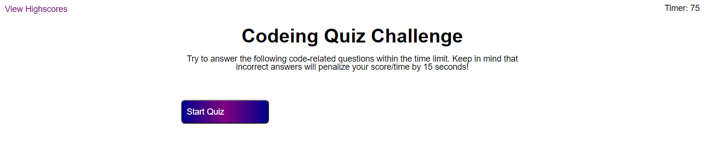

* click the start button to start the quiz
* First question and timer for 75 seconds
* When a question is answered it tells the user if they got it right/wrong and moves to the next question.
* When a question is wrong 10 seconds is removed from the timer.
* When the timer is 0 or all the questions are answered the game is over.
* The user is shown their score and given the chance to save their high score.  
https://lemelisk27.github.io/code-quiz/  
